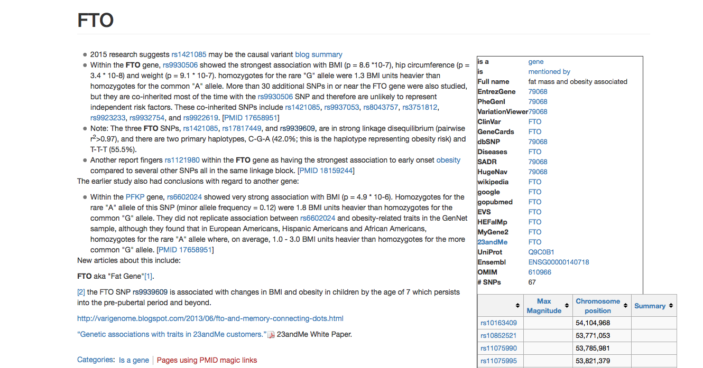

# Computer Session 3: Descriptive Statistics, Quality Control and Association Analysis 
## [Oxford NCRM Summer School](http://www.oxfordsociogenetics.com):
### An introduction to combining social science and molecular genetic research
 

nicola.barban@nuffield.ox.ac.uk


---

# Outline
## In this computer lab we will learn how to ... 
1. Open and work with Plink Binary files
2. Derive information on Allele frequencies and missing values
3. Recode a plink file in other formats
4. Select information on particular markers or on a subsample of individuals
5. Attach a phenotype to a plink file
6. Do quality control
7. Run association analysis
8. Run a Genome-Wide Association Analysis


---


# Opening a plink file
* Let's start by opening a plink binary file. 
* You can find the example files in the `/data` folder.

* We are going to use the data from HapMap3 (release 2)  - NCBI Build 36. In particular, we are using the CEU population, i.e. Utah residents with Northern and Western European ancestry. More information on Hapmap available  [here](http://www.sanger.ac.uk/resources/downloads/human/hapmap3.html).

* Data come from the [Center for Statistical Genetics, University of Michigan]http://csg.sph.umich.edu/abecasis/mach/download/HapMap3.r2.b36.html

```
./plink --bfile ../data/hapmap3-r2_b36_CEU
```

* The `--file` option expects that there will be suitable ped/map files with the given base name. So in the above example, there must be files `hapmap.ped ` and `hapmap.map`

* Plink will typically output files to disk. If you don’t specify an output name, it will use the name plink. In this case, a file called `plink.log` is created. You can change the basename with the `--out` option
---

# Deriving allele frequencies

```
./plink --bfile ../data/hapmap3-r2_b36_CEU --freq 


PLINK v1.90b4.3 64-bit (9 May 2017)            www.cog-genomics.org/plink/1.9/
(C) 2005-2017 Shaun Purcell, Christopher Chang   GNU General Public License v3
Logging to plink.log.
Options in effect:
  --bfile ../data/hapmap3-r2_b36_CEU
  --freq

16384 MB RAM detected; reserving 8192 MB for main workspace.
1416121 variants loaded from .bim file.
165 people (80 males, 85 females) loaded from .fam.
Using 1 thread (no multithreaded calculations invoked).
Before main variant filters, 112 founders and 53 nonfounders present.
Calculating allele frequencies... done.
Warning: 819 het. haploid genotypes present (see plink.hh ); many commands
treat these as missing.
Total genotyping rate is 0.996191.
--freq: Allele frequencies (founders only) written to plink.frq .


```
---
# Allele Frequencies

* Let's have a look at the output file `plink.frq` using the unix command `k`
* Note that not all the markers are *measured* in all individuals

```
head plink.frq

 CHR                           SNP   A1   A2          MAF  NCHROBS
   1                     rs6650104    G    A     0.009009      222
   1                    rs11510103    G    A     0.009174      218
   1                    rs12565286    C    G      0.03241      216
   1                     rs3094315    G    A       0.1622      222
   1                     rs3131972    A    G       0.1652      224
   1                     rs3115860    C    A       0.1351      222
   1                     rs3131969    A    G       0.1339      224
   1                     rs3131967    T    C       0.1171      222
   1                     rs1048488    C    T       0.1667      222

```
---

# Recoding
* Data can be transformed into other formats

```
head ../data/hapmap3-r2_b36_CEU.bim
1	rs6650104	0	554340	G	A
1	rs11510103	0	557616	G	A
1	rs12565286	0	711153	C	G
1	rs3094315	0	742429	G	A
1	rs3131972	0	742584	A	G
1	rs3115860	0	743268	C	A
1	rs3131969	0	744045	A	G
1	rs3131967	0	744197	T	C
1	rs1048488	0	750775	C	T
1	rs3115850	0	751010	T	C
```

```
plink 	--bfile ../data/hapmap3-r2_b36_CEU /
	 	--recode --allele1234 /
		--make-bed --out ../data/recodedHapmap

head ../data/recodedHapmap.bim
1	rs6650104	0	554340	3	1
1	rs11510103	0	557616	3	1
1	rs12565286	0	711153	2	3
1	rs3094315	0	742429	3	1
1	rs3131972	0	742584	1	3
1	rs3115860	0	743268	2	1
1	rs3131969	0	744045	1	3
1	rs3131967	0	744197	4	2
1	rs1048488	0	750775	2	4
1	rs3115850	0	751010	4	2

```
---

# FTO snps
[Source](https://www.snpedia.com/index.php/FTO)



---
# Extracting only entries for particular SNPs

We may want to extract only information from a particular SNP (or a list of snps)

```
plink 	--bfile ../data/hapmap3-r2_b36_CEU /
		--snps  rs9930506 /
		--recode /
		--out  rs9930506sample
```

```
head rs9930506sample.ped
1328 NA06989 0 0 2 -9 G A
1377 NA11891 0 0 1 -9 G A
1349 NA11843 0 0 1 -9 A A
1330 NA12341 0 0 2 -9 G A
1444 NA12739 NA12748 NA12749 1 -9 G A
1344 NA10850 0 NA12058 2 -9 A A
1328 NA06984 0 0 1 -9 G A
1463 NA12877 NA12889 NA12890 1 -9 G A
1418 NA12275 0 0 2 -9 A A
13291 NA06986 0 0 1 -9 G A

```
---

# Extracting named individuals. 

### Or we may want to selects a subsample of individuals.

* The `--keep` option can be used to select individuals from the sample.
* The `--exclude` option does the inverse

```

plink 	--bfile ../data/hapmap3-r2_b36_CEU /
		--keep list.txt /
		--make-bed --out  selectedIndividuals

PLINK v1.90b4.3 64-bit (9 May 2017)            www.cog-genomics.org/plink/1.9/
(C) 2005-2017 Shaun Purcell, Christopher Chang   GNU General Public License v3
Logging to selectedIndividuals.log.
Options in effect:
  --bfile ../data/hapmap3-r2_b36_CEU
  --keep list.txt
  --make-bed
  --out selectedIndividuals

16384 MB RAM detected; reserving 8192 MB for main workspace.
1416121 variants loaded from .bim file.
165 people (80 males, 85 females) loaded from .fam.
--keep: 20 people remaining.
Using 1 thread (no multithreaded calculations invoked).
Before main variant filters, 13 founders and 7 nonfounders present.
Calculating allele frequencies... done.
Total genotyping rate in remaining samples is 0.99507.
1416121 variants and 20 people pass filters and QC.
Note: No phenotypes present.
--make-bed to selectedIndividuals.bed + selectedIndividuals.bim +
selectedIndividuals.fam ... done.

```
---


# Phenotypes

* So far, we have not attached any **phenotype** to the plink genotype data. 
* We can specify a phenotype from an external file. 


```
plink 	--bfile ../data/hapmap3-r2_b36_CEU /
	 	--pheno ../data/EA.phen /
		--make-bed --out ../data/hapmap_EA /
		
		```

* Using the file `EA.phen`, we can attach the phenotype **Educational Attianment** to the HapMap genotype. 
* Note that this phenotype is simulated

```
head   ../data/hapmap_EA.fam
1328 NA06989 0 0 2 -2.59514
1377 NA11891 0 0 1 -3.71914
1349 NA11843 0 0 1 8.91508
1330 NA12341 0 0 2 3.91863
1444 NA12739 NA12748 NA12749 1 9.71398
1344 NA10850 0 NA12058 2 6.41934
1328 NA06984 0 0 1 5.54098
1463 NA12877 NA12889 NA12890 1 -4.06391
1418 NA12275 0 0 2 3.06437
13291 NA06986 0 0 1 3.42843

```
---

# Missing values

* We can calculate missing values, i.e. How many genetic marker are missing for each individual and on how many individuals a marker is measured


```
plink --bfile hapmap_EA --missing

head plink.imiss
 FID       IID MISS_PHENO   N_MISS   N_GENO   F_MISS
   1328   NA06989          N     6229  1416121 0.004399
   1377   NA11891          N    22843  1416121  0.01613
   1349   NA11843          N     2410  1416121 0.001702
   1330   NA12341          N     7957  1416121 0.005619
   1444   NA12739          N    31507  1416121  0.02225
   1344   NA10850          N     3956  1416121 0.002794
   1328   NA06984          N     9832  1416121 0.006943
   1463   NA12877          N     6208  1416121 0.004384
   1418   NA12275          N     8112  1416121 0.005728
```
---


# Hardy-Weinberg Equilibrium
From [Nature Education](https://www.nature.com/scitable/definition/hardy-weinberg-equilibrium-122)

> "The Hardy-Weinberg equilibrium is a principle stating that the genetic variation in a population will remain constant from one generation to the next in the absence of disturbing factors. When mating is random in a large population with no disruptive circumstances, the law predicts that both genotype and allele frequencies will remain constant because they are in equilibrium." 


```
plink --bfile hapmap_EA --hardy
head plink.hwe
 CHR                           SNP     TEST   A1   A2                 GENO   O(HET)   E(HET)            P 
   1                     rs6650104  ALL(QT)    G    A              0/2/109  0.01802  0.01786            1
   1                    rs11510103  ALL(QT)    G    A              1/0/108        0  0.01818     0.004608
   1                    rs12565286  ALL(QT)    C    G              0/7/101  0.06481  0.06271            1
   1                     rs3094315  ALL(QT)    G    A              2/32/77   0.2883   0.2717       0.7326
   1                     rs3131972  ALL(QT)    A    G              2/33/77   0.2946   0.2758       0.7324
   1                     rs3115860  ALL(QT)    C    A              2/26/83   0.2342   0.2337            1
   1                     rs3131969  ALL(QT)    A    G              2/26/84   0.2321    0.232            1
   1                     rs3131967  ALL(QT)    T    C              2/22/87   0.1982   0.2068       0.6402
   1                     rs1048488  ALL(QT)    C    T              2/33/76   0.2973   0.2778       0.7324


```
---

# Quality control
**Quality control is a stanard procedure that filters out SNPs with low quality**

*  `--mind` excludes individuals with missing genotype data above the given rate
*  `--geno` option remove SNPs tha have less than the specified call rate
*  `--maf` option can be used to remove SNPs with minor allele frequencies below a certain rate
* `--hwe` option can be used to remove SNPs which fail Hardy-Weinberg test

```bash

plink		--bfile ../data/hapmap_EA \
			--geno 0.05 \
			--maf 0.01 \
			--mind 0.05 \
			--hwe 1e-4 \
			--make-bed \
			--out hapmap_EA_qc

```
---


# Other filters

Plink has other filters implemented:


*            `--filter-controls` 
Filter controls with a binary phenotype

*          ` --filter-males` 
Keep only males (based on genotype data)

*          `--filter-females` 
Keep only females (based on genotype data)

*         `--filter-founders` 
Keep only founders (i.e. no parental IDs present)

*         `--filter-nonfounders`


```
 plink 	--bfile hapmap_EA_qc \
 		--filter-females \
		--make-bed
 
 
 
PLINK v1.90b4.3 64-bit (9 May 2017)            www.cog-genomics.org/plink/1.9/
(C) 2005-2017 Shaun Purcell, Christopher Chang   GNU General Public License v3
Logging to plink.log.
Options in effect:
  --bfile hapmap_EA_qc
  --filter-females
  --make-bed
  
  
16384 MB RAM detected; reserving 8192 MB for main workspace.
1352473 variants loaded from .bim file.
165 people (80 males, 85 females) loaded from .fam.
165 phenotype values loaded from .fam.
80 people removed due to gender filter (--filter-females).
Using 1 thread (no multithreaded calculations invoked).
Before main variant filters, 55 founders and 30 nonfounders present.
Calculating allele frequencies... done.
Total genotyping rate in remaining samples is 0.996233.
1352473 variants and 85 people pass filters and QC.
Phenotype data is quantitative.
--make-bed to plink.bed + plink.bim + plink.fam ... done.
```
---


# Association testing
Finally, we can test the association between a genotype and a phenotype.


### Quantitative trait association


```
plink 	--bfile hapmap_EA_qc \
 		--snps rs2883059 \
		--assoc \
		--out EArs2883059
		
```		
 --assoc writes the results of a 1df chi-square allelic test 
 
 with fields as follows:
```
      CHR      Chromosome number
      SNP      SNP identifier
      BP       Physical position (base-pair)
      NMISS    Number of non-missing genotypes
      BETA     Regression coefficient
      SE       Standard error
      R2       Regression r-squared
      T        Wald test (based on t-distribtion)
      P        Wald test asymptotic p-value
```
---

# Association Results

```
plink 	--bfile hapmap_EA_qc \
 		--snps rs2883059 \
		--assoc \
		--out EArs2883059

 head  EArs2883059_assoc.qassoc
 CHR         SNP         BP    NMISS       BETA         SE         R2        T            P 
   3   rs2883059   49877164      165    -0.2672     0.5132    0.00166  -0.5206       0.6033 


```
---


# Genome-wide association

Given a quantitative phenotype and possibly some **covariates** (in a `--covar` file), `--linear` writes a linear regression report to `plink.assoc.linear`. Similarly, `--logistic` performs logistic regression given a case/control phenotype and some covariates.


```
 plink --bfile hapmap_EA_qc  --linear --out genome_wide_assoc

 head  genome_wide_assoc.qassoc
 CHR                           SNP         BP    NMISS       BETA         SE         R2        T            P 
   1                    rs12565286     711153      160    -0.3284      1.645  0.0002522  -0.1996        0.842 
   1                     rs3094315     742429      163    -0.2264      0.755  0.0005584  -0.2999       0.7646 
   1                     rs3131972     742584      165    -0.2227      0.743  0.0005507  -0.2997       0.7648 
   1                     rs3115860     743268      164    -0.2729       0.78  0.0007553  -0.3499       0.7268 
   1                     rs3131969     744045      165    -0.3077     0.7795  0.0009552  -0.3948       0.6935 
   1                     rs3131967     744197      164   -0.03563     0.8089  1.198e-05 -0.04405       0.9649 
   1                     rs1048488     750775      164    -0.2462     0.7453  0.0006729  -0.3303       0.7416 
   1                     rs3115850     751010      160    -0.2331     0.7828  0.0005608  -0.2978       0.7663 
   1                     rs2286139     751595      160     -0.304     0.7933  0.0009288  -0.3833        0.702 
 

```
---

# More on Association results


* Plink can perform many different types of association analysis. 
* You can find extensive documentation [here](https://www.cog-genomics.org/plink/1.9/assoc)
* Types of association analysis
	* Linear, logistic regression
	* Stratified case/control analyses
	* Dosage data
	* LASSO regression
	* Linear mixed model association
	* Within-family Analysis
	
---

# LD between two SNPs

* Plink can be also used to check the *correlation* between two markers. 
* The command `--ld` inspects the relation between a single pair of variants in more detail,  which displays observed and expected (based on MAFs) frequencies of each haplotype, as well as haplotype-based r2 and D'.


```

 plink --bfile hapmap_EA_qc  --ld rs2883059 rs2777888
 
 
 --ld rs2883059 rs2777888:

    R-sq = 0.735714       D' = 1

    Haplotype     Frequency    Expectation under LE
    ---------     ---------    --------------------
           CA     -0                       0.213173
           TA      0.459459                0.246287
           CG      0.463964                0.250791
           TG      0.076577                0.289749

```
---

# Make relationship matrix

Plink can also calculate **genetic similarity** calculating a relationship matrix similarly to GCTA.


```
 plink --bfile hapmap_EA_qc  --make-rel 
 
 
  head  plink.rel
 0.98719
 -0.0112276	0.995042
 -0.0176723	-0.00790896	0.98841
 -0.0155196	-0.00428746	-0.013437	0.987771
 -0.0134685	-0.00757551	-0.00261808	-0.00791749	0.986429
 -0.000507025	-0.00503598	0.00578777	0.0048012	-0.000155744	1.01504
 -0.0156985	-0.00740312	-0.00804985	-0.00788587	-0.0105131	0.00492533	0.98436
 -0.000176277	-0.00828891	-0.00425097	-0.00764017	-0.00879957	-0.00195497	-0.00224949	0.992188
 -0.00894951	-0.00266942	-0.00832618	-0.00585218	-0.010791	-0.00277052	-0.010719	-0.0124266	0.999569
 
```
---
